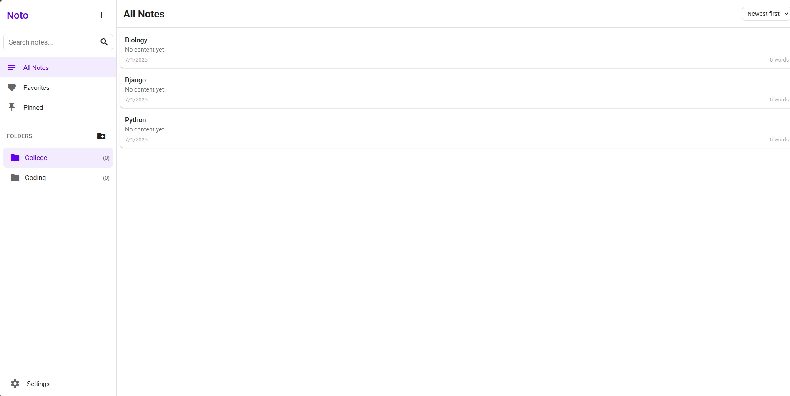
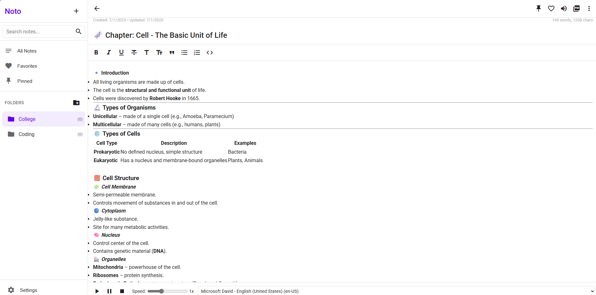

# Noto - Mobile Notes App

Noto is a clean, responsive notes application designed for mobile and desktop use. It offers a simple yet powerful interface for creating, organizing, and managing your notes with features like folders, favorites, pinning, and more.

## Features

- 📝 **Rich Text Notes**: Create notes with formatting options (bold, italic, headings, lists, etc.)
- 📂 **Folder Organization**: Organize notes into custom folders
- ⭐ **Favorites**: Mark important notes as favorites for quick access
- 📌 **Pinned Notes**: Keep frequently used notes at the top
- 🔍 **Search**: Quickly find notes by title or content
- 🎨 **Customization**: Multiple themes and font options
- 🗣️ **Text-to-Speech**: Have your notes read aloud
- 📄 **PDF Export**: Save notes as PDF files
- 🔄 **Backup & Restore**: Import/export all your notes
- 📱 **Responsive Design**: Works on mobile and desktop
- 💾 **Offline Support**: All data stored locally in your browser

## How to Use

1. **Create a new note**: Click the "+" button in the sidebar
2. **Format text**: Use the formatting toolbar for styling
3. **Organize notes**:
   - Create folders with the "New Folder" button
   - Drag notes to folders (or use the "Move to folder" option)
   - Pin important notes to keep them at the top
   - Mark notes as favorites for quick access
4. **Search**: Type in the search bar to filter notes
5. **Export**: Save notes as PDF or export all data as JSON backup

## Keyboard Shortcuts

When editing a note:
- `Ctrl+B` - Bold text
- `Ctrl+I` - Italic text
- `Ctrl+U` - Underline text

## 📸 Screenshots

### 🔹 Noto - Preview 1

  

### 🔹 Noto - Preview 2

  

## Installation

Noto is a pure web application - no installation needed! Just open the HTML file in any modern browser.

For offline use:
1. Download the `index.html` file
2. Open it in your browser
3. All your notes will be saved in your browser's local storage

## Browser Support

Noto works best in modern browsers including:
- Chrome
- Firefox
- Edge
- Safari (iOS and macOS)

## Data Storage

All notes are stored locally in your browser's `localStorage`. This means:
- Your data stays private on your device
- No accounts or logins required
- Works completely offline

For backup, use the Export feature to save all your notes as a JSON file.

## Development

To modify or extend Noto:

1. Clone/download the project
2. Edit the `index.html` file
3. Open in browser to test changes

## Future Improvements

Planned features:
- [ ] Note tagging system
- [ ] Dark mode toggle
- [ ] Note sharing options
- [ ] Cloud sync option
- [ ] Markdown support

## License

MIT License - Free to use and modify

## Credits

💻 Developed by ZIPPTECH  
🌐 [ZIPPTECH Website](https://zipptech.xyz)

---

**Enjoy taking notes with Noto!** ✏️
