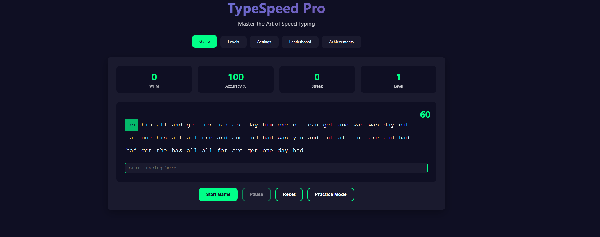
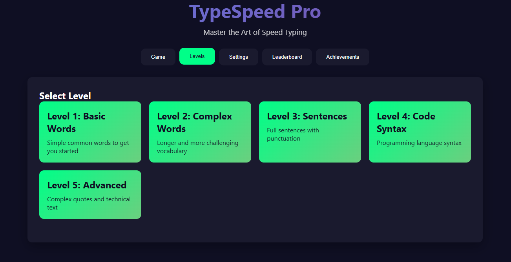
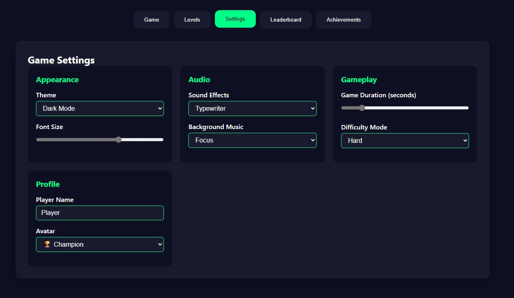
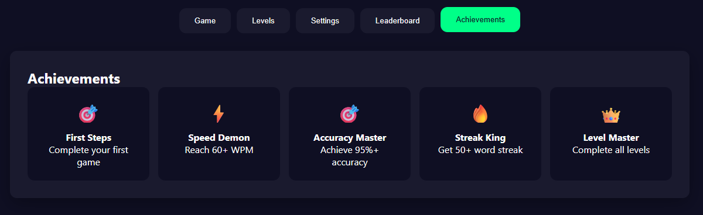

# 🖱️ TypeSpeed Pro - Ultimate Typing Game

**TypeSpeed Pro** is a powerful and interactive typing game developed by the **ZIPPTech Team** to help users enhance their typing speed, accuracy, and overall keyboard skills. With rich features, sleek animations, and customizable gameplay, it makes learning to type fast both fun and rewarding.

---
## Check Out: [TypeSpeed Pro](https://zipptech.xyz/projects/typespeedpro.html)

## 🚀 Key Features

- **🎮 Game Modes**
  - **Timed Challenge** – Customizable duration
  - **Infinite Practice Mode** – Practice without limits
  - **Level-Based Challenges** – 5 difficulty levels

- **📊 Performance Tracking**
  - Real-time **WPM (Words Per Minute)**
  - **Accuracy percentage** and **streak counter**
  - Visual **progress bar** and animated feedback

- **🏆 Achievements & Leaderboard**
  - Unlockable badges like:
    - **Speed Demon** (60+ WPM)
    - **Accuracy Master** (95%+ accuracy)
    - **Streak King** (50+ word streak)
  - **Top 10 Leaderboard** saved via LocalStorage

- **🎨 Customization Options**
  - Choose from **Dark**, **Light**, or **Neon** themes
  - Adjustable **font sizes**, sound effects, and music
  - Custom **player name & avatar**

- **⚙️ Built With**
  - **HTML5**, **CSS3**, **JavaScript (ES6+)**
  - **GSAP** for smooth animations
  - **LocalStorage** for data persistence

---

## 🧠 Educational Value

- Boosts typing speed and accuracy
- Builds muscle memory for touch typing
- Encourages consistent practice through gamification

---

## 📦 How to Use

1. Open the HTML file in any modern browser.
2. Customize your settings in the **Settings** tab.
3. Start a level or jump into **Practice Mode**.
4. Track your stats and unlock achievements as you improve.

---

## 👨‍💻 Developed By

**ZiPPTech Team** – Empowering learning through fun, interactive technology.

---

## 📸 Preview

Here are some screenshots of **TypeSpeed Pro** in action:

### 🕹️ Game Interface

### 🎯 Level Selection & Settings

### 🏆 Leaderboard  & Achievements

---

## 🌟 Future Enhancements

- Multiplayer mode
- Cloud-based leaderboard
- Custom text input
- Daily challenges & mobile app version

---

> **TypeSpeed Pro** is more than just a game — it's a tool to help you type faster, better, and smarter.
